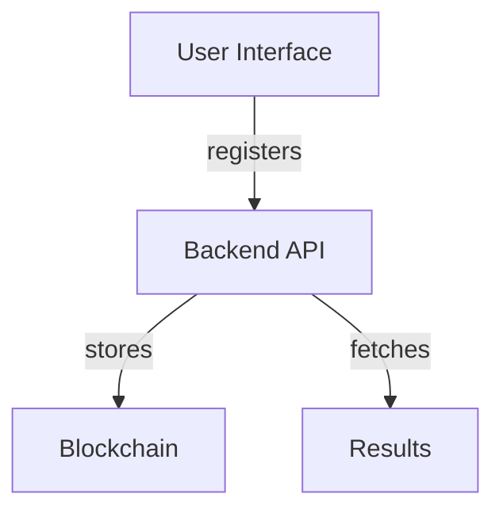

# Web3 Decentralized Voting System

## Specification
This project implements a decentralized voting system using blockchain principles to ensure immutability and transparency.

## Architecture Diagram


## Setup Instructions
1. Clone the repository.
2. Navigate to the `backend` directory and run `docker-compose up`.
3. Access the frontend at `http://localhost:5000`.

## Key Features
- Register as a voter.
- Cast votes anonymously.
- View real-time election results.

## Example Usage
To register a voter:
```bash
curl -X POST http://localhost:8000/register -H 'Content-Type: application/json' -d '{"id": "1", "name": "Alice", "eligible": true}'
```
To cast a vote:
```bash
curl -X POST http://localhost:8000/vote -H 'Content-Type: application/json' -d '{"voter_id": "1", "candidate": "Bob"}'
```
To get results:
```bash
curl http://localhost:8000/results
```